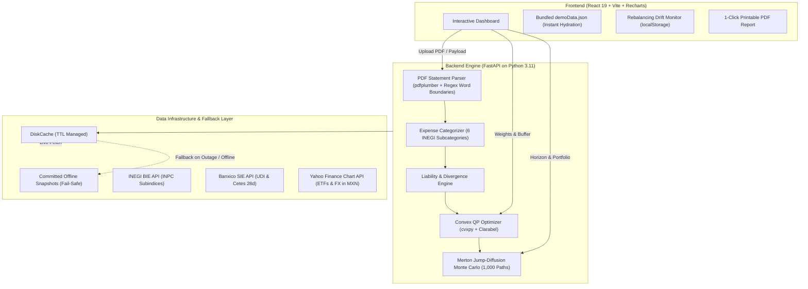

<p align="center">
  
</p>

<h1 align="center">LifeHedge</h1>

<p align="center">
  <strong>Personal Liability-Driven Investment (pLDI) for Mexican Households: Hedging Real Consumption Inflation with Institutional Precision.</strong>
</p>

<p align="center">
  <a href="#-tech-stack"></a>
  <a href="#-tech-stack"></a>
  <a href="#-tech-stack"></a>
  <a href="#-tech-stack"></a>
  <a href="#-tests--validation"></a>
  <a href="#-market-data-sources"></a>
  <a href="#-the-quantitative-engine"></a>
  <a href="#-backend-setup"></a>
  <a href="LICENSE"></a>
</p>

---

## 📌 Executive Summary

Conventional personal finance apps benchmark portfolios against generic market indices (like the S&P 500 or the Mexican IPC), ignoring the most critical financial reality of a family: **their actual consumption liability**.

A household allocating 40% of its budget to food and transit faces a personal inflation rate drastically higher and more volatile than the headline national **INPC** reported by INEGI. 

Institutional pension funds solved this disconnect decades ago using **Liability-Driven Investment (LDI)**. **LifeHedge** adapts this institutional framework to household scale (**pLDI**):
1. Reads Mexican bank statement PDFs in memory without storing data.
2. Computes the family's exact personal inflation curve and **Divergence Delta**.
3. Solves a **Convex Quadratic Program (QP)** to construct the optimal portfolio hedging the family's specific basket.
4. Models discrete price shocks using **Merton Jump-Diffusion Monte Carlo** to quantify downside tail risk (**VaR 95%** and **CVaR 95%**).

---

## ⚖️ Conventional Investing vs. LifeHedge pLDI

| Dimension | Retail Robo-Advisors / Wealth Apps | LifeHedge (Personal LDI) |
|---|---|---|
| **Benchmark** | Generic market index (e.g. S&P 500, IPC) | The family's real consumption basket ($L_t$) |
| **Objective Function** | Maximize nominal return $\max E[r]$ | Minimize surplus tracking variance $\min \text{Var}(r_{\text{portfolio}} - r_{\text{liability}})$ |
| **Inflation Measure** | Headline official INPC (national average) | Personal inflation based on 6 INEGI expenditure subindices |
| **Currency Risk** | Unhedged noise or plain FX loss | Active hedging instrument (USD/MXN hedges imported goods) |
| **Cash Strategy** | Idle cash or blind 100% Cetes allocation | Optimal balance: inflation-hedging assets + liquidity buffer |
| **Tail Risk Model** | Gaussian / Normal assumptions | Merton Jump-Diffusion (captures supply shocks & agricultural freezes) |

---

## 🏛️ System Architecture



---

## 🧮 Mathematical Foundations

### 1. The Personal Liability ($L_t$)
Given normalized expenditure weights $s_j$ across the 6 expenditure categories ($\sum_{j=1}^6 s_j = 1$), the household's monthly liability return is:
$$L_t = \sum_{j=1}^6 s_j \cdot \pi_{j,t}$$
where $\pi_{j,t}$ represents the monthly variation in INEGI's subindex for expenditure category $j$.

The **Divergence Delta** quantifies the annualized gap against official headline inflation:
$$\Delta_{\text{divergencia}} = 12 \cdot \left(\mathbb{E}[L_t] - \mathbb{E}[\pi_{\text{INPC general}, t}]\right)$$

### 2. Convex Quadratic Programming Optimization
We minimize surplus risk (tracking error variance between portfolio returns and personal liability inflation), subject to full investment, long-only positions, and a liquidity constraint:

$$\min_{w} \quad w^T \Sigma_A w - 2 \lambda w^T \Sigma_{AL} y$$
$$\text{subject to} \quad \sum_{i=1}^n w_i = 1, \quad w_i \ge 0, \quad w_{\text{cetes}} \ge \text{buffer}$$

- $\Sigma_A \in \mathbb{R}^{n \times n}$: Covariance matrix of monthly asset returns.
- $\Sigma_{AL} \in \mathbb{R}^{n \times 1}$: Covariance vector between assets and personal inflation.
- **Personal Hedge Efficiency (PHE)**:
  $$\text{PHE} = 1 - \frac{\text{Var}(r_{\text{portfolio}} - r_{\text{liability}})}{\sigma_L^2} \in [0, 1]$$
  *(Measures the exact proportion of consumption inflation variance neutralized by the portfolio).*

### 3. Merton Jump-Diffusion Process
To account for sudden price spikes (e.g., fuel shocks, agricultural freezes):
$$\frac{dS_t}{S_t} = \mu \, dt + \sigma \, dW_t + (J - 1) \, dN_t$$
where:
- $N_t \sim \text{Poisson}(\lambda)$: Jump arrival process.
- $\log J \sim \mathcal{N}(\mu_J, \sigma_J^2)$: Jump amplitude distribution.
- Simulated over $1,000$ trajectories to compute **VaR 95%** and **CVaR 95%** (Expected Shortfall).

---

## 💼 The Asset Universe

All assets are denominated or converted to **Mexican Pesos (MXN)**. Exchange-rate volatility is utilized as a first-class hedging instrument against imported inflation:

| Ticker | Asset Class | Primary Liability Hedged | Source |
|---|---|---|---|
| `UDIBONO` | Mexican Sovereign Inflation-Linked Bond | Direct general INPC via UDI indexation | Banxico SIE (`SP68257`) |
| `CETES28` | 28-day Mexican Treasury Bill | Liquidity buffer & short-term nominal risk-free rate | Banxico SIE (`SF43936`) |
| `NAFTRACISHRS.MX` | S&P/BMV IPC Index | Domestic economic growth & corporate pricing power | Yahoo Finance v8 |
| `IVVPESOISHRS.MX` | S&P 500 (Currency Hedged to MXN) | Global equity exposure & technological productivity | Yahoo Finance v8 |
| `GLD` | Gold Bullion (converted to MXN) | Geopolitical tail risk, systemic stress & monetary debasement | Yahoo Finance v8 |
| `XLE` | Energy Select Sector SPDR (in MXN) | Electricity tariffs, domestic gas & vehicle fuel costs | Yahoo Finance v8 |
| `DBA` | Invesco DB Agriculture Fund (in MXN) | Food basket, grains, produce & supermarket essentials | Yahoo Finance v8 |
| `MXN=X` | USD/MXN Exchange Rate | Imported goods inflation & currency depreciation pass-through | Yahoo Finance v8 |

---

## 🚀 Key User Features

1. **Onboarding & Instant Demo**: Upload standard bank statement PDFs (BBVA, Santander, Banorte, HSBC, Citibanamex, Scotiabank) or launch instantly with bundled sample data.
2. **Personal Inflation Dashboard**: Interactive sliders to adjust expenditure weights in real time with dynamic Delta recalculation.
3. **Optimal Coverage (Hedge Frontier)**: Visual comparison of LifeHedge vs. 100% Cetes, asset allocation bar charts, and efficient frontier scatter plots.
4. **Risk & Tail Scenarios**: Interactive 1–36 month horizon slider with percentiles fan chart (p5, p25, p50, p75, p95), VaR 95%, and CVaR 95%.
5. **Rebalancing Alerts**: Automated drift detection across personal delta ($\ge 1\%$), spending basket ($\ge 2\%$), and portfolio weights ($\ge 3\%$) persisted in browser storage.
6. **Executive Summary PDF**: One-click printable executive report with dedicated `@media print` typography.

---

## 🛠️ Quick Start

### Prerequisites
- **Python 3.11+**
- **Node.js 18+** & **npm**

### 1. Backend Setup
```bash
cd backend

# Create virtual environment and install dependencies
python -m venv .venv
./.venv/Scripts/activate       # On Windows (or source .venv/bin/activate on Linux/Mac)
pip install -r requirements.txt

# Seed synthetic cache for instant development (no API tokens required)
python -m scripts.seed_dev_cache

# Launch FastAPI server
python -m uvicorn app.main:app --reload --port 8000
```
API docs will be available at: `http://localhost:8000/docs`

### 2. Frontend Setup
```bash
cd frontend

# Install dependencies
npm install

# Configure environment
cp .env.example .env

# Run development server
npm run dev
```
The application will launch at: `http://localhost:5173`

---

## 🧪 Tests & Validation

The test suite runs **hermetically offline** without requiring external network connectivity or API tokens:

```bash
# Run backend tests (66 passing unit and integration tests)
cd backend
./.venv/Scripts/pytest.exe -v

# Run frontend linter
cd frontend
npm run lint

# Build production bundle
npm run build
```

---

## 🛡️ Privacy & Production Resilience

- **Zero-Storage Privacy Architecture**: Uploaded PDF statements are parsed in volatile RAM and immediately discarded. No personal names, account numbers, or balances are ever stored on disk or databases.
- **Fail-Safe Data Engine**: Calls to external APIs (INEGI, Banxico, Yahoo) are cached on disk with TTL. If any provider experiences downtime, the backend seamlessly falls back to pre-committed snapshot data with `stale: true`, guaranteeing **zero 500 errors during evaluations**.
- **Cold-Start Elimination**: The frontend renders immediately upon load with bundled dataset hydration (`demoData.json`), completely preventing blank screens while cloud containers spin up.

---

## 📄 License

Distributed under the **MIT License**. See [`LICENSE`](LICENSE) for more information.

<p align="center">
  <sub>Developed for the <strong>Coppel Hackathon 2026</strong>. Built with institutional rigor for household empowerment.</sub>
</p>
